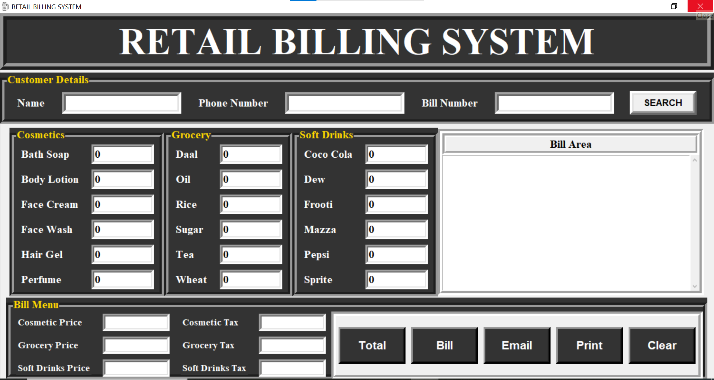

# 🧾 Retail Billing System (Python Tkinter)

A **desktop-based Retail Billing System** developed using **Python and Tkinter**, designed to automate the billing process in small retail shops.  
The application allows users to generate bills, calculate item-wise prices, apply taxes, save bills, print bills, and send invoices via email.

## 📌 Project Overview

This project demonstrates my ability to design and implement a **real-world desktop application** using Python.  
It focuses on **GUI development, event-driven programming, file handling, and user interaction**, which are essential skills for software development internships.

---

## 📌 Key Features

- 🛒 Category-wise product billing (Cosmetics, Grocery, Soft Drinks)
- 🧮 Automatic price & tax calculation
- 🧾 Bill generation with customer details
- 💾 Save bills locally with unique bill numbers
- 🔍 Search previously saved bills
- 🖨️ Print bills directly from the application
- 📧 Send bills via email using SMTP
- 🧹 Clear/reset bill for next customer
- 🖥️ User-friendly GUI built with Tkinter

---

## 🛠️ Technologies Used

- **Programming Language:** Python  
- **GUI Framework:** Tkinter  
- **Libraries & Modules:**
  - `tkinter`
  - `messagebox`
  - `random`
  - `os`
  - `tempfile`
  - `smtplib`
- **IDE:** VS Code  
- **Version Control:** Git & GitHub  


## 📂 Project Structure

Retail-Billing-Machine/
│
├── main.py # Main application file
├── bills/ # Stores saved bill files
├── icon-ico.ico # Application icon
├── README.md # Project documentation


## ▶️ How to Run the Project

### 1️⃣ Prerequisites
- Python 3.x installed  
- Tkinter (comes pre-installed with Python)

### 2️⃣ Clone the Repository
```bash
git clone https://github.com/harshpreetkaur1012-web/Retail-Billing-Machine.git

3️⃣ Navigate to Project Folder
cd Retail-Billing-Machine

4️⃣ Run the Application
python main.py

🧾 How the Application Works
Enter Customer Name and Phone Number
Add quantities for required products
Click Total to calculate prices and taxes
Click Bill to generate the bill
Use options to:
Save the bill
Search old bills
Print the bill
Send bill via email

Retail-Billing-Machine/
│
├── screenshots/
│   ├── image-1.png
│   ├── image-2.png
│   └── image-3.png


## 📸 Screenshots

### 🖥️ Main Application Interface


### 🧾 Generated Bill Output


### 📧 Email Bill Feature


### 🖥️ Dashboard View


### 🧾 Billing Page


### 📊 Sales Report


📸 Output
Displays a detailed bill with:
Product name
Quantity
Price
Tax details
Total amount
Bills are saved as .txt files inside the bills/ folder

## 🎯 Learning Outcomes

- Built a complete desktop application from scratch
- Strengthened understanding of GUI-based workflows
- Applied Python concepts to solve real business problems
- Learned how to structure and document a production-ready project
- Gained hands-on experience with GitHub collaboration workflows


🎯 Learning Outcomes
Practical experience with Python GUI development
Understanding of event-driven programming
File handling in Python
Working with SMTP for email functionality
Real-world billing system logic
Hands-on use of Git & GitHub

## 💼 Internship Relevance

This project reflects my readiness for **Software Development / Python Internship roles** by demonstrating:
- Ability to translate requirements into a working application
- Clean and modular code structure
- Practical understanding of user-facing software
- Experience with debugging, testing, and improving features


🚀 Future Enhancements
Database integration (MySQL / SQLite)
Login & authentication system
PDF bill generation
Improved UI styling
Product management dashboard

👩‍💻 Author

Harshpreet Kaur
B.Tech CSE Student (2027)
Aspiring Software / AI Engineer

🔗 GitHub: https://github.com/harshpreetkaur1012-web

⭐ If you find this project useful, feel free to star the repository!


