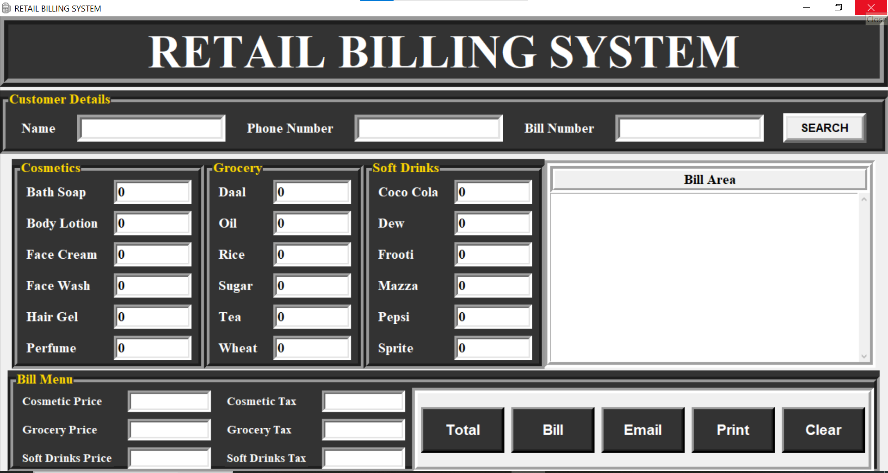
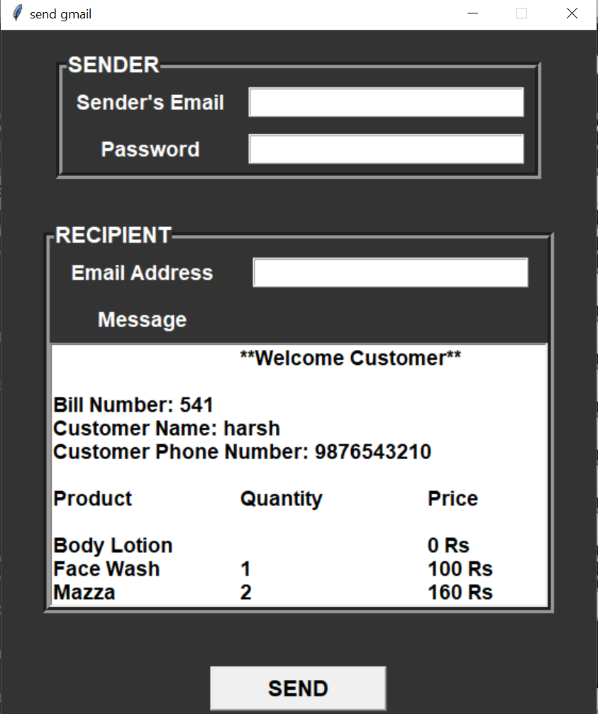

<div align="center">

# 🧾 Retail Billing System

### A Modern Desktop Billing Application built using Python & Tkinter


<br><br>

A desktop-based Retail Billing System developed using **Python** and **Tkinter** to automate billing operations for small retail stores.

Generate invoices, calculate taxes automatically, save bills, print receipts, and even send invoices through email.

⭐ If you like this project, consider giving it a star.

</div>

---

# 🎥 Project Demo

<p align="center">
<a href="https://www.youtube.com/watch?v=QR9y0MvY8Vw">

</a>
</p>

<div align="center">

▶️ **Click the image above to watch the full project demonstration**

</div>

---

# 📖 Project Overview

The Retail Billing System is a desktop application built to simplify billing operations in retail shops.

The application demonstrates GUI development, event-driven programming, file handling, email integration, and real-world software engineering concepts using Python.

---

# ✨ Features

✅ Category-wise product billing

✅ Automatic GST & Tax Calculation

✅ Customer Information Management

✅ Auto-generated Bill Numbers

✅ Save Bills

✅ Search Existing Bills

✅ Print Bills

✅ Email Bills using SMTP

✅ Reset Bill

✅ Clean Tkinter GUI

---

# 🛠 Tech Stack

| Technology | Usage |
|------------|-------|
| Python | Programming Language |
| Tkinter | GUI Development |
| SMTP | Email Sending |
| OS Module | File Handling |
| tempfile | Printing |
| VS Code | IDE |
| Git | Version Control |
| GitHub | Repository Hosting |

---

# 📸 Screenshots

## 🖥️ Home Window

<p align="center">

</p>

---

## 🧾 Generated Bill

<p align="center">

</p>

---

## 📧 Email Feature

<p align="center">

</p>

---

# 📂 Project Structure

```text
Retail-Billing-Machine/
│
├── Retail billing machine.py
├── icon-ico.ico
├── image-1.png
├── image-2.png
├── image-3.png
├── README.md
└── bills/
```

---

# 🚀 Installation

## Clone Repository

```bash
git clone https://github.com/harshpreetkaur1012-web/Retail-Billing-Machine.git
```

---

## Move into Project

```bash
cd Retail-Billing-Machine
```

---

## Run Application

```bash
python "Retail billing machine.py"
```

---

# 💻 Application Workflow

```text
Start Application
       │
       ▼
Enter Customer Details
       │
       ▼
Select Products
       │
       ▼
Calculate Total
       │
       ▼
Generate Bill
       │
       ├────────► Save Bill
       │
       ├────────► Search Bill
       │
       ├────────► Print Bill
       │
       └────────► Email Bill
```

---

# 📊 Project Highlights

- Desktop Billing Software
- Event-driven Programming
- GUI Development
- Modular Code Structure
- File Handling
- Email Integration
- Print Functionality

---

# 🎯 Learning Outcomes

✔ Python GUI Development

✔ Tkinter Widgets

✔ Event Handling

✔ File Management

✔ SMTP Email Service

✔ Real-world Business Logic

✔ Git & GitHub Workflow

---

# 💼 Internship Relevance

This project demonstrates:

- Problem Solving
- Clean UI Design
- Python Programming
- Software Engineering Principles
- Business Application Development
- User-centric Development

---

# 🚀 Future Improvements

- SQLite Database
- Login Authentication
- Dashboard Analytics
- Product Inventory
- PDF Invoice
- Barcode Scanner
- Dark Mode
- GST Reports
- Sales Dashboard

---

# 👩‍💻 Author

## Harshpreet Kaur

B.Tech Computer Science Engineering (2027)

Python Developer | AI Enthusiast | Software Developer

### GitHub

https://github.com/harshpreetkaur1012-web

### LinkedIn

https://www.linkedin.com/in/harshpreetkaur1012/

---

<div align="center">

### ⭐ Star this repository if you found it useful!

Made with ❤️ by Harshpreet Kaur

</div>
